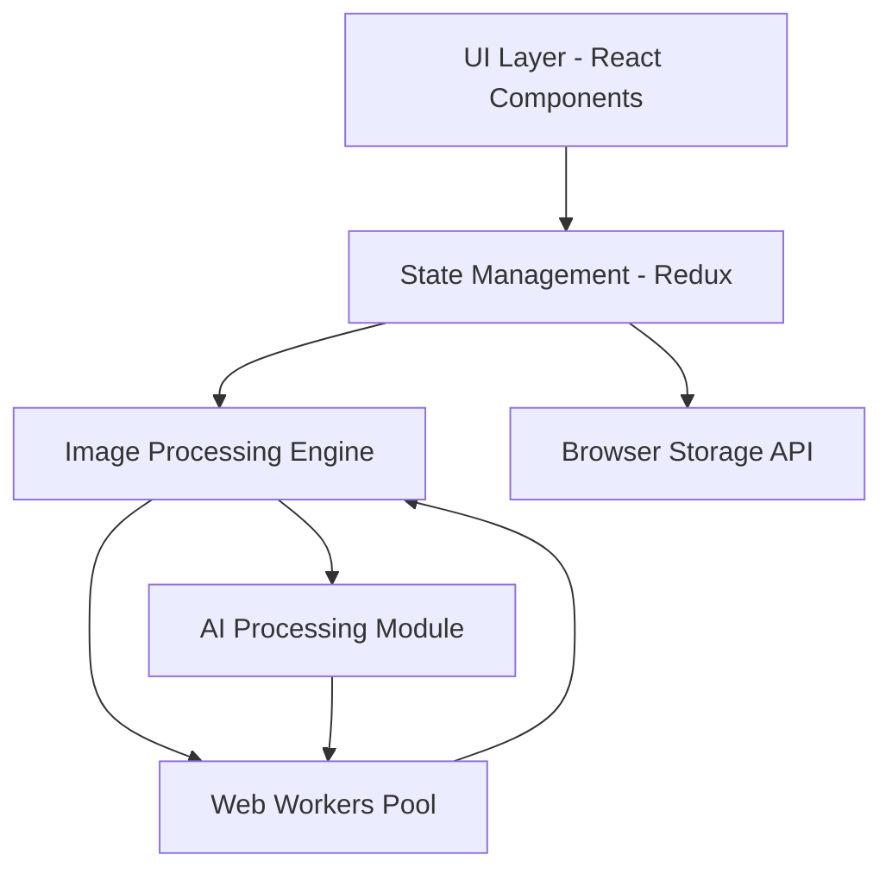

# Pixaro Design Document

## Overview

Pixaro is a client-side web application that provides professional photo editing capabilities similar to Adobe Lightroom. The application runs entirely in the browser using modern web technologies including WebGL for high-performance image processing, Web Workers for non-blocking operations, and browser storage APIs for preset management. All photo processing occurs locally on the user's device, ensuring privacy and eliminating server dependencies.

The architecture follows a modular design with clear separation between the UI layer, image processing engine, and state management. This enables maintainability, testability, and future extensibility.

## Architecture

### High-Level Architecture



### Technology Stack

**Frontend Framework:**
- React 18+ with TypeScript for type safety and component architecture
- Redux Toolkit for predictable state management
- React Router for potential future multi-page features

**Image Processing:**
- WebGL 2.0 via custom shaders for real-time adjustments (exposure, color, etc.)
- Canvas API for export and non-WebGL operations
- Web Workers for CPU-intensive operations (RAW processing, AI inpainting)

**AI/ML:**
- TensorFlow.js for client-side AI inpainting model
- Pre-trained model based on context-aware fill algorithms (similar to LaMa or MAT)
- Model loaded lazily when user first accesses removal tool

**Styling:**
- CSS Modules or Styled Components for component-scoped styling
- Dark theme implemented via CSS custom properties
- Responsive design using CSS Grid and Flexbox

**Build Tools:**
- Vite for fast development and optimized production builds
- Web Assembly (WASM) for RAW file decoding (using libraw or similar)

**Ad Integration:**
- Google AdSense or similar ad network
- Lazy-loaded ad components to minimize performance impact

## Components and Interfaces

### Core Components

#### 1. Application Shell (`App.tsx`)
Main application container that manages layout and routing.

```typescript
interface AppProps {}

interface AppState {
  isLoading: boolean;
  error: Error | null;
}
```

#### 2. Canvas Component (`Canvas.tsx`)
Displays the photo with applied edits using WebGL rendering.

```typescript
interface CanvasProps {
  imageData: ImageData;
  adjustments: AdjustmentState;
  zoom: number;
  pan: { x: number; y: number };
}

interface CanvasMethods {
  resetView(): void;
  fitToScreen(): void;
  exportImage(format: ExportFormat, quality: number): Blob;
}
```

#### 3. Editing Panel (`EditingPanel.tsx`)
Container for all adjustment controls, organized into collapsible sections.

```typescript
interface EditingPanelProps {
  activeSection: EditingSection;
  onSectionChange: (section: EditingSection) => void;
}

type EditingSection = 
  | 'basic' 
  | 'color' 
  | 'detail' 
  | 'effects' 
  | 'hsl' 
  | 'crop' 
  | 'removal';
```

#### 4. Adjustment Controls
Individual slider and control components for each editing parameter.

```typescript
interface SliderControlProps {
  label: string;
  value: number;
  min: number;
  max: number;
  step: number;
  onChange: (value: number) => void;
  unit?: string;
}
```

#### 5. Histogram Component (`Histogram.tsx`)
Real-time histogram display showing tonal distribution.

```typescript
interface HistogramProps {
  imageData: ImageData;
  width: number;
  height: number;
}
```

#### 6. Preset Manager (`PresetManager.tsx`)
Displays built-in and custom presets with apply/save/delete functionality.

```typescript
interface Preset {
  id: string;
  name: string;
  adjustments: AdjustmentState;
  thumbnail?: string;
  isBuiltIn: boolean;
}

interface PresetManagerProps {
  presets: Preset[];
  onApply: (preset: Preset) => void;
  onSave: (name: string) => void;
  onDelete: (id: string) => void;
}
```

#### 7. Removal Tool (`RemovalTool.tsx`)
AI-powered brush tool for removing objects and blemishes.

```typescript
interface RemovalToolProps {
  imageData: ImageData;
  brushSize: number;
  onBrushSizeChange: (size: number) => void;
  onRemovalComplete: (result: ImageData) => void;
}

interface RemovalMask {
  pixels: Uint8Array;
  bounds: { x: number; y: number; width: number; height: number };
}
```

#### 8. Export Dialog (`ExportDialog.tsx`)
Modal for configuring export settings.

```typescript
interface ExportSettings {
  format: 'jpeg' | 'png' | 'tiff';
  quality: number; // 1-100 for JPEG
  width: number;
  height: number;
  maintainAspectRatio: boolean;
  includeMetadata: boolean;
}
```

#### 9. Ad Container (`AdContainer.tsx`)
Wrapper component for ad units with lazy loading.

```typescript
interface AdContainerProps {
  adSlot: string;
  position: 'sidebar' | 'bottom';
  maxRefreshInterval: number; // milliseconds
}
```

### Image Processing Engine

#### Core Processing Interface

```typescript
interface ImageProcessor {
  // Load and decode image
  loadImage(file: File): Promise<ProcessedImage>;
  
  // Apply adjustments
  applyAdjustments(
    image: ProcessedImage, 
    adjustments: AdjustmentState
  ): ProcessedImage;
  
  // Geometric transformations
  crop(image: ProcessedImage, bounds: CropBounds): ProcessedImage;
  rotate(image: ProcessedImage, angle: number): ProcessedImage;
  
  // Export
  export(
    image: ProcessedImage, 
    settings: ExportSettings
  ): Promise<Blob>;
  
  // AI operations
  removeObjects(
    image: ProcessedImage, 
    mask: RemovalMask
  ): Promise<ProcessedImage>;
}
```

#### WebGL Shader Pipeline

The image processing engine uses a shader pipeline for real-time adjustments:

1. **Base Texture Shader**: Loads original image data
2. **Tonal Adjustment Shader**: Applies exposure, contrast, highlights, shadows, whites, blacks
3. **Color Adjustment Shader**: Applies temperature, tint, vibrance, saturation
4. **HSL Adjustment Shader**: Applies selective color adjustments
5. **Detail Shader**: Applies sharpening, clarity, noise reduction
6. **Effects Shader**: Applies vignette, grain
7. **Output Shader**: Final composition and color space conversion

Each shader reads from the previous shader's output texture, enabling efficient GPU-based processing.

#### Web Worker Architecture

```typescript
// Main thread
interface WorkerPool {
  execute<T>(
    task: WorkerTask, 
    data: ArrayBuffer
  ): Promise<T>;
}

// Worker thread
interface WorkerTask {
  type: 'decode-raw' | 'ai-inpaint' | 'export' | 'histogram';
  payload: any;
}
```

Workers handle:
- RAW file decoding (WASM-based)
- AI inpainting computation
- High-resolution export rendering
- Histogram calculation

## Data Models

### Adjustment State

```typescript
interface AdjustmentState {
  // Basic adjustments
  exposure: number;        // -5 to +5
  contrast: number;        // -100 to +100
  highlights: number;      // -100 to +100
  shadows: number;         // -100 to +100
  whites: number;          // -100 to +100
  blacks: number;          // -100 to +100
  
  // Color adjustments
  temperature: number;     // 2000 to 50000 (Kelvin)
  tint: number;           // -150 to +150
  vibrance: number;       // -100 to +100
  saturation: number;     // -100 to +100
  
  // Detail adjustments
  sharpening: number;     // 0 to 150
  clarity: number;        // -100 to +100
  noiseReductionLuma: number;    // 0 to 100
  noiseReductionColor: number;   // 0 to 100
  
  // HSL adjustments
  hsl: {
    [key in ColorChannel]: {
      hue: number;        // -100 to +100
      saturation: number; // -100 to +100
      luminance: number;  // -100 to +100
    }
  };
  
  // Geometric
  crop: CropBounds | null;
  straighten: number;     // -45 to +45 degrees
  
  // Effects
  vignette: {
    amount: number;       // -100 to +100
    midpoint: number;     // 0 to 100
    feather: number;      // 0 to 100
  };
  grain: {
    amount: number;       // 0 to 100
    size: 'fine' | 'medium' | 'coarse';
  };
  
  // Removal operations (stored as history)
  removals: RemovalOperation[];
}

type ColorChannel = 
  | 'red' 
  | 'orange' 
  | 'yellow' 
  | 'green' 
  | 'aqua' 
  | 'blue' 
  | 'purple' 
  | 'magenta';

interface CropBounds {
  x: number;
  y: number;
  width: number;
  height: number;
  aspectRatio: number | null;
}

interface RemovalOperation {
  id: string;
  mask: RemovalMask;
  timestamp: number;
}
```

### Application State (Redux)

```typescript
interface RootState {
  image: ImageState;
  adjustments: AdjustmentState;
  ui: UIState;
  history: HistoryState;
  presets: PresetState;
}

interface ImageState {
  original: ProcessedImage | null;
  current: ProcessedImage | null;
  metadata: ImageMetadata | null;
  isLoading: boolean;
}

interface ProcessedImage {
  data: ImageData;
  width: number;
  height: number;
  colorSpace: string;
}

interface ImageMetadata {
  format: string;
  width: number;
  height: number;
  exif: Record<string, any>;
  colorProfile: string;
}

interface UIState {
  activeSection: EditingSection;
  zoom: number;
  pan: { x: number; y: number };
  showHistogram: boolean;
  showComparison: boolean;
  isExportDialogOpen: boolean;
  activeTool: 'none' | 'crop' | 'removal';
  brushSize: number;
}

interface HistoryState {
  past: AdjustmentState[];
  present: AdjustmentState;
  future: AdjustmentState[];
  maxHistorySize: number;
}

interface PresetState {
  builtIn: Preset[];
  custom: Preset[];
  isLoading: boolean;
}
```

## Error Handling

### Error Categories

1. **File Loading Errors**
   - Unsupported format
   - File too large
   - Corrupted file
   - Browser API not supported

2. **Processing Errors**
   - WebGL context lost
   - Worker timeout
   - Out of memory
   - AI model loading failure

3. **Export Errors**
   - Export timeout
   - Insufficient storage
   - Browser download blocked

### Error Handling Strategy

```typescript
interface AppError {
  code: ErrorCode;
  message: string;
  severity: 'warning' | 'error' | 'fatal';
  recoverable: boolean;
  userMessage: string;
}

enum ErrorCode {
  FILE_TOO_LARGE = 'FILE_TOO_LARGE',
  UNSUPPORTED_FORMAT = 'UNSUPPORTED_FORMAT',
  WEBGL_NOT_SUPPORTED = 'WEBGL_NOT_SUPPORTED',
  PROCESSING_TIMEOUT = 'PROCESSING_TIMEOUT',
  OUT_OF_MEMORY = 'OUT_OF_MEMORY',
  AI_MODEL_LOAD_FAILED = 'AI_MODEL_LOAD_FAILED',
  EXPORT_FAILED = 'EXPORT_FAILED',
}
```

**Error Recovery:**
- Automatic fallback to Canvas API if WebGL fails
- Retry mechanism for AI model loading (max 3 attempts)
- Graceful degradation for unsupported features
- User-friendly error messages with actionable suggestions
- Error boundary components to prevent full app crashes

**Logging:**
- Console logging in development
- Optional anonymous error reporting in production (with user consent)
- Performance monitoring for slow operations

## Testing Strategy

### Unit Testing

**Tools:** Vitest, React Testing Library

**Coverage:**
- Utility functions (color space conversions, calculations)
- Redux reducers and actions
- Individual React components (isolated)
- Image processing algorithms (non-WebGL)

**Example Test Cases:**
- Adjustment value clamping
- Preset save/load/delete operations
- History undo/redo logic
- File format validation

### Integration Testing

**Tools:** Vitest, React Testing Library, MSW for mocking

**Coverage:**
- Component interaction flows
- State management integration
- Worker communication
- Storage API integration

**Example Test Cases:**
- Upload image → apply adjustments → export workflow
- Apply preset → modify → save as new preset
- Undo/redo with multiple adjustment changes
- Comparison mode toggle

### End-to-End Testing

**Tools:** Playwright

**Coverage:**
- Complete user workflows
- Cross-browser compatibility
- Performance benchmarks
- Ad integration (non-intrusive behavior)

**Example Test Cases:**
- Full editing session from upload to export
- Multiple photo editing in sequence
- Preset application across different images
- AI removal tool workflow

### Performance Testing

**Metrics:**
- Initial load time (target: < 3s)
- Time to interactive (target: < 4s)
- Adjustment preview latency (target: < 100ms for most operations)
- Export time for various file sizes
- Memory usage during extended sessions
- AI inpainting processing time

**Tools:**
- Lighthouse for web vitals
- Chrome DevTools Performance profiler
- Custom performance markers for critical operations

### Visual Regression Testing

**Tools:** Percy or Chromatic

**Coverage:**
- UI component rendering
- Dark theme consistency
- Responsive layout breakpoints
- Ad placement and sizing

## Performance Optimization

### Image Processing Optimizations

1. **Preview vs. Full Resolution**
   - Render adjustments on downscaled preview (max 2048px)
   - Apply full resolution only on export
   - Reduces GPU memory and processing time

2. **Shader Optimization**
   - Combine multiple adjustments into single shader passes where possible
   - Use texture caching to avoid redundant computations
   - Implement dirty flagging to skip unchanged operations

3. **Web Worker Utilization**
   - Offload CPU-intensive tasks to prevent UI blocking
   - Implement worker pool with task queue
   - Use transferable objects to minimize data copying

4. **Lazy Loading**
   - Load AI model only when removal tool is first used
   - Lazy load ad scripts
   - Code splitting for non-critical features

### Memory Management

1. **Texture Cleanup**
   - Dispose WebGL textures when no longer needed
   - Implement LRU cache for processed images
   - Monitor GPU memory usage

2. **History Limits**
   - Cap undo history at 50 operations
   - Store only adjustment parameters, not full image data
   - Implement history pruning for memory-constrained devices

3. **Image Data Handling**
   - Use typed arrays for efficient memory usage
   - Avoid unnecessary image data copies
   - Release file references after loading

### Caching Strategy

1. **Browser Storage**
   - LocalStorage for presets (< 5MB limit)
   - IndexedDB for larger data if needed
   - Cache AI model in browser cache

2. **Computation Caching**
   - Memoize expensive calculations
   - Cache histogram data
   - Cache shader compilation results

## Security Considerations

1. **Client-Side Processing**
   - All images processed locally (privacy by design)
   - No image data sent to servers
   - No user tracking beyond anonymous analytics

2. **File Validation**
   - Validate file types before processing
   - Sanitize file metadata
   - Limit file sizes to prevent DoS

3. **Content Security Policy**
   - Strict CSP headers
   - Whitelist ad domains
   - Prevent inline script execution

4. **Dependency Management**
   - Regular security audits of npm packages
   - Use Snyk or similar for vulnerability scanning
   - Keep dependencies updated

## Accessibility

1. **Keyboard Navigation**
   - All controls accessible via keyboard
   - Logical tab order
   - Keyboard shortcuts for common actions

2. **Screen Reader Support**
   - ARIA labels for all interactive elements
   - Meaningful alt text
   - Status announcements for async operations

3. **Visual Accessibility**
   - High contrast UI elements (4.5:1 minimum)
   - Adjustable UI scaling
   - Focus indicators

4. **Responsive Design**
   - Mobile-friendly layout
   - Touch-optimized controls
   - Adaptive UI for different screen sizes

## Ad Integration Design

### Ad Placement Strategy

```typescript
interface AdPlacement {
  position: 'sidebar-top' | 'sidebar-bottom' | 'bottom-bar';
  maxWidth: number;
  maxHeight: number;
  refreshInterval: number; // milliseconds, minimum 30000
}

const AD_PLACEMENTS: AdPlacement[] = [
  {
    position: 'sidebar-bottom',
    maxWidth: 300,
    maxHeight: 250,
    refreshInterval: 60000, // 1 minute
  },
  {
    position: 'bottom-bar',
    maxWidth: 728,
    maxHeight: 90,
    refreshInterval: 90000, // 1.5 minutes
  },
];
```

### Ad Behavior Rules

1. **Non-Intrusive Display**
   - Maximum 2 ad units visible simultaneously
   - Positioned outside Canvas and primary editing controls
   - No overlay or modal ads

2. **Refresh Logic**
   - Pause refresh during active editing (user input within last 30 seconds)
   - Minimum 30-second interval between refreshes
   - Respect user's reduced-motion preferences

3. **Performance**
   - Lazy load ad scripts after initial app load
   - Use Intersection Observer for viewability
   - Implement ad blocker detection (graceful handling)

4. **User Experience**
   - No auto-playing audio/video
   - No pop-ups or redirects
   - Clear visual separation from app content

## Deployment Architecture

### Build Configuration

```typescript
// vite.config.ts
export default defineConfig({
  build: {
    target: 'es2020',
    rollupOptions: {
      output: {
        manualChunks: {
          'vendor': ['react', 'react-dom', 'redux'],
          'image-processing': ['./src/engine'],
          'ai': ['@tensorflow/tfjs'],
        },
      },
    },
  },
  worker: {
    format: 'es',
  },
});
```

### Hosting

- Static hosting (Vercel, Netlify, or Cloudflare Pages)
- CDN for global distribution
- Gzip/Brotli compression
- HTTP/2 or HTTP/3 support

### Asset Optimization

- Image assets optimized and served as WebP
- Fonts subset and preloaded
- Critical CSS inlined
- Service Worker for offline capability (optional future enhancement)

## Future Extensibility

### Potential Enhancements

1. **Cloud Sync** (optional premium feature)
   - Save presets across devices
   - Project history sync

2. **Batch Processing**
   - Apply edits to multiple photos
   - Queue-based processing

3. **Advanced Tools**
   - Graduated filters
   - Radial filters
   - Brush-based local adjustments

4. **Collaboration**
   - Share edit links
   - Export adjustment presets

5. **Mobile App**
   - Progressive Web App (PWA)
   - Native mobile apps using React Native

### Plugin Architecture (Future)

```typescript
interface PixaroPlugin {
  id: string;
  name: string;
  version: string;
  init(api: PluginAPI): void;
  destroy(): void;
}

interface PluginAPI {
  registerTool(tool: CustomTool): void;
  registerPreset(preset: Preset): void;
  registerExportFormat(format: ExportFormat): void;
}
```

This design provides a solid foundation for building Pixaro while maintaining flexibility for future enhancements and optimizations.
